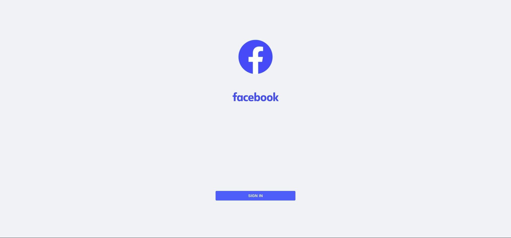
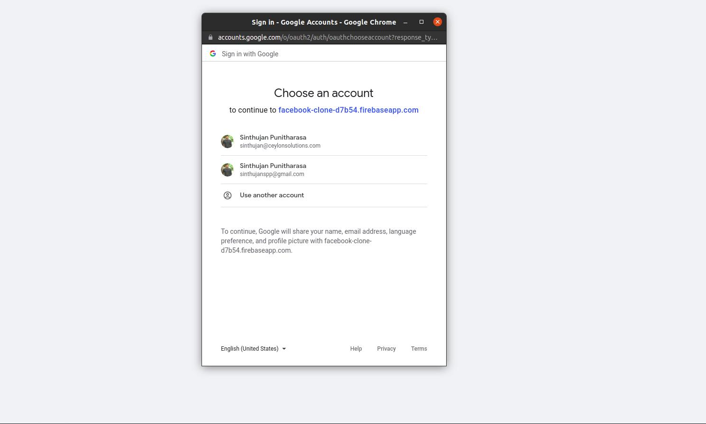
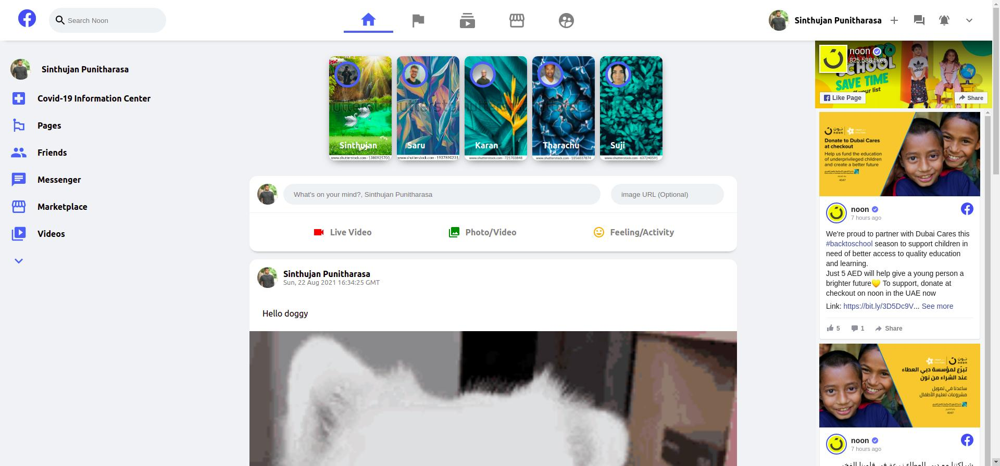
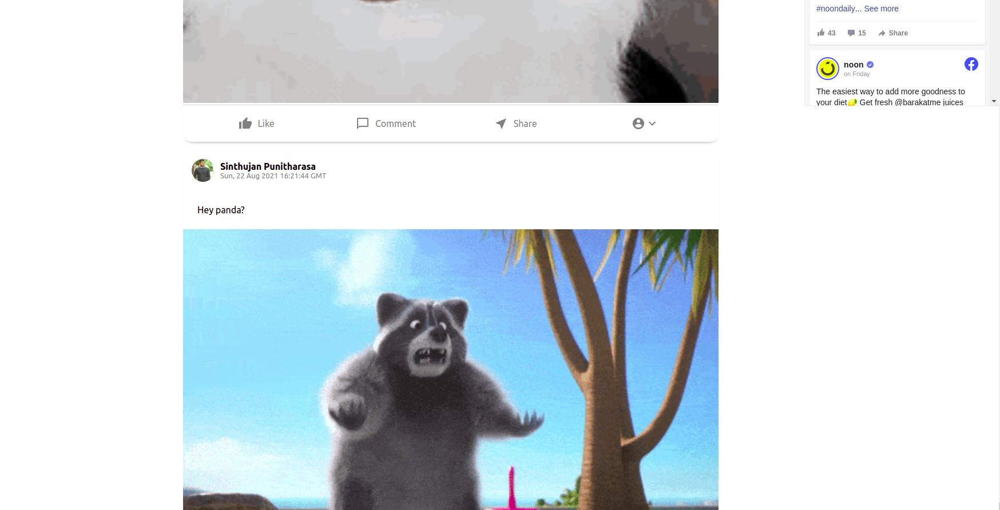

# Facebook Clone App

### This is the clone of Facebook app which built using **React js and Firebase**. Where it has a functionality to **Add a posts in, google authentication and Webpage embeded and also having firebase realtime DB**.
 &nbsp;

### To Run this App just clone the code and install the dependecies by using 

```
npm install
```
### After that type
 ```
npm start
```
### Then Login to into the App by using Google Authentication.
 &nbsp;

## This is Link for the deployed of this App in the cloud.

## [FaceBook Clone Hosted App](https://facebook-clone-d7b54.web.app/) 
&nbsp;
### To add the post in real time just type something in news feed and insert the image url if you want a post with image and press **Enter** The post will appear below.

## Here are the some snap shots of this App.
 &nbsp;
### 1.LoginPage

 &nbsp;
### 2.AunthenticationPage

&nbsp;
### 3.HomePage-1

&nbsp;
### 3.HomePage-2
